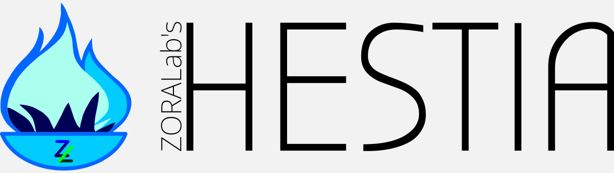

# ZORALab's Hestia (Go Programming Language)

One Peaceful Frontend+Backend Software Library Suite - Go Programming Language.

The project is to unify all common libraries and data structure into 1 single
repository for highest attributes of reusablity, smoother learning curves, and a
more wholesome tools alignments. Develop and learn advanced products easily with
less worries about supply chain problems.

Visit the official Website for its live deployment, documentations,
getting started guides, and etc!

| Language          | URL                                |
|:------------------|:-----------------------------------|
| English (Global)  | https://hestia.zoralab.com/en      |
| 华语（国际）      | https://hestia.zoralab.com/zh-hans |

## Why It Matters
This project was initiated primarily because of:

1. **Be done with supply chain threats** caused by geo-political nuisance, dirty
   after the fact shenanigans, or cut-throat charges.
2. **Simple to integrate** with a simple `zip` archive format + its GPG
   cryptography signature for integrity checking.
3. **Deploy everywhere** from servers to microcontrollers where anything that
   can compute.

## License
The project is licensed under multiple licenses depending on the content you're
using. Please visit the
[Official License Page](https://hestia.zoralab.com/licenses) for detailed info.
In summary:

1. Codes — [OSI compliant Apache 2.0](https://opensource.org/license/apache-2-0/)
2. Media (Image, audio, etc) — `Restricted License`. Go source from the artists
   directly.

## Roadmaps
This project is a huge and ambitious one. It aims to be inter-operable between
**Go**, **TinyGo**, and **Nim** covering outputs like `Backend`, `Frontend UI`,
`PWA`, `WASM`, and `Embedded` (microcontrollers). We divided the tasks into
phases viewable in our
[GitHub Project](https://github.com/orgs/ZORALab/projects/6).
